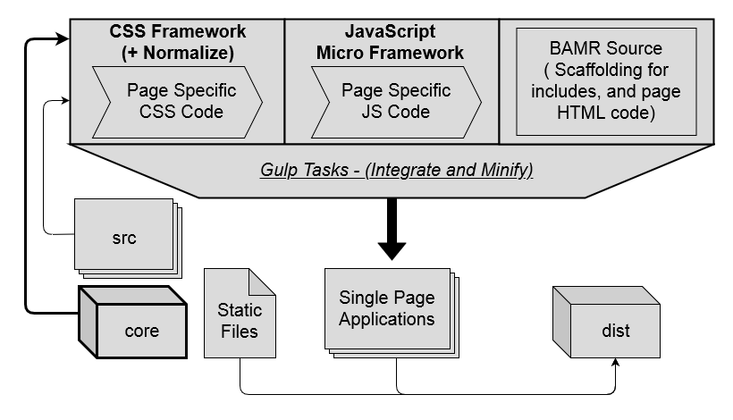

    

# ESP Single Page Application Library Integration Framework
**ESPALIF is a build system for Single-Page-Applications that are written in HTML/CSS/JS.**
  

## Motivation
ESPALIF was designed to provide a flexible Interface Development Kit that was capable of generating entire families of Single-Page-Applications, without resorting to **HUGE** frameworks like Angular or React. The ESP-8266 (an otherwise capable microchip) requires an SSL handshake for each file request, so developing a system for bundling and compressing the GUI SPAs was critical, versus having each SPA load an additional 4 or 5 files at minimum. Although this project was designed for low-capability microchip servers, it can be used to develop families of "vanilla" HTML/CSS/JS interfaces for any type of server infrastructure.

## Interface Families
ESPALIF interface families are defined by the injected frameworks for each set of SPAs. Each build contains project-level CSS and JS frameworks along with page-specific CSS and JS chunks, all of which are injected into the Basic Automated Markup Reduction templates. These combined injections allow for each SPA to contain relevant code while still maintaining a set of global design and function languages. By leveraging that consistency across a project, a set of SPAs can be produced that follow common patterns and thus can be considered as a family of interfaces.

## Architecture
ESPALIF builds a set of SPAs by minimizing content, performing injections into BAMR templates, and then minimizing that output into the `dist` folder, where it also copies any files from the `static` directory. This set of files can then be copied into any static delivery system to provide the GUIs to clients.

**Visual Concept:**

    

## Included Frameworks
The following frameworks are included (in [`assets/frameworks`](./assets/frameworks)) with ESPALIF:

| Name | Type | Version | Link | Description |
| --- | :---: | :---: | :---: | --- |
| Normalize | CSS | 8 | [HERE](https://necolas.github.io/normalize.css/) | Helps browsers render consistently (**default**) |
| Skeleton | CSS | 2.0.4 | [HERE](http://getskeleton.com/) | A micro-css library (**default**) |
| Lotus | CSS | - | [HERE](https://goatslacker.github.io/lotus.css/) | A micro-css library |
| Picnic | CSS | - | [HERE](https://picnicss.com/) | A micro-css library |
| *blank* | CSS | - | - | An empty CSS library for basic projects |
| microCash | JS | 4.1.5 | - | A custom micro version of cash.js (**default**) |
| Cash | JS | 4.1.5 | [HERE](https://github.com/kenwheeler/cash) | A small jQuery alternative |
| Umbrella | JS | - | [HERE](https://github.com/franciscop/umbrella) | A small jQuery alternative |
| *blank* | JS | - | - | An empty JS library for basic projects |

 

## Example
The repo contains a small example project with three SPAs, built using `normalize_v8.css`, `skeleton.css`, and `microCash.js`:
 - **index** - The "hub" of the example, allows moving between the other SPAs
 - **tiny** - The "smallest possible" SPA that includes all framework injections
 - **demo** - A page to demonstrate CSS/JS framework capabilities

Remember to `npm install` first, and don't forget to have `gulp-cli` installed globally for Node. Projects can be built by running `gulp` or `npm run build`, and served locally by running `npm run serve`. Editing or replacing the project files will allow for development of a custom project - folder layout and current frameworks are defined in the project's `build.json` file.
