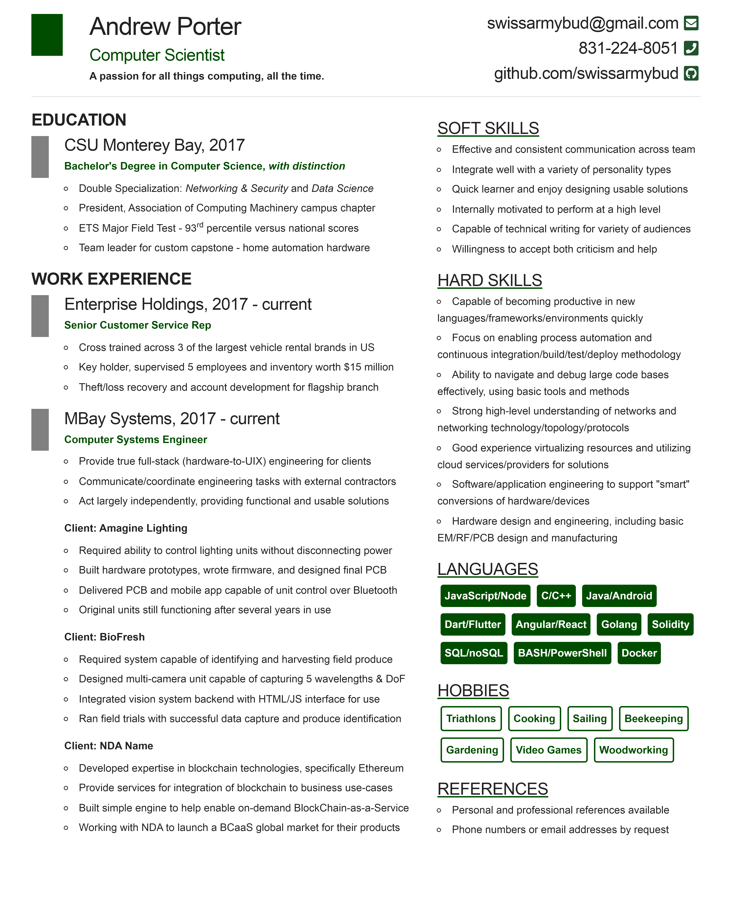

<p align="center">
    
</p>

# Trident - PNG/PDF Resume Generator
**PNG/PDF generation system for the creation of personalized resumes from HTML/CSS/JS files.**
<br>

## Build System
Trident is a specialized application of the [ESPALIF](https://github.com/SwissArmyBud/ESPALIF) system, tailored towards the production of resumes instead of interactive micro-sites. More information can be found at the ESPALIF repo, but to run this project just clone the repo and run the following commands:
```
npm install
gulp build
```
#### *NOTE:*
  - Gulp-CLI must be installed first, see [HERE](https://gulpjs.com/docs/en/getting-started/quick-start) for instructions.
  - ImageMagick is also needed to output PDF conversions, it is available [HERE.](https://imagemagick.org/script/download.php)

## Architecture
[ESPALIF](https://github.com/SwissArmyBud/ESPALIF) is used to build a small SPA and then [Puppeteer](https://developers.google.com/web/tools/puppeteer) is used to load the webpage and take a high-res screenshot of the final micro-site. Once the screenshot is available, [ImageMagick](https://imagemagick.org/index.php) is used to convert that into a PDF and the process is complete.

## Personal Example
The repo contains my resume as an example, both in source and build form. The current resume in PDF form can be found by [clicking HERE,](./project/dist/) and the PNG is used for the thumbnail below. The HTML/CSS/JS can be modified as desired to personalize the resume, feel free to submit creations to the issues page!
<p align="center">
    
</p>
